# 20273029 한채윤

## 1주차 과제

## 2주차 과제

</img>

## 3주차 과제

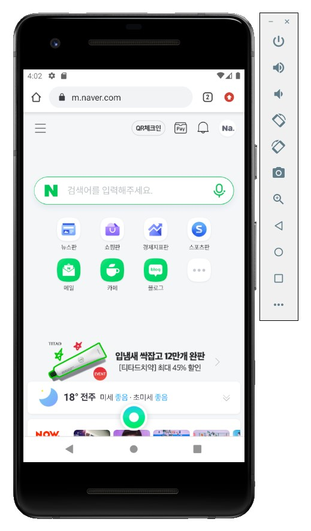</img>
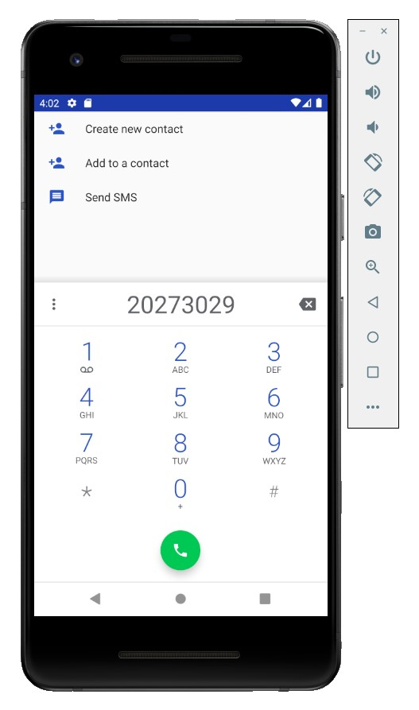</img>

## 4주차 과제

 여러 가게(편의점, 마트, 옷 가게, 철물점 등)의 판매 품목과 재고, 가격 등을 실시간으로 볼 수 있고, 지도 이용과 품목 검색, 가격 비교 등이 가능한 앱

 필요하거나 가지고 싶은 것이 있다면 지도를 이용해 어떤 가게에 해당 품목이 있고 재고는 얼마나 남아있는지, 가격은 얼마인지 등을 볼 수 있습니다. 각 점포마다 판매하는 품목이 조금씩 달라 사려고 했던 것을 사지 못하거나 재고가 떨어져 헛걸음을 하게 될 일도 사라질 것입니다. 특정 품목을 검색해 어떤 가게에서 판매하고 있는지, 어느 가게에서 더 가성비 좋은 것을 구매할 수 있는지 등 상품 정보를 볼 수 있고 가격 비교 등이 가능합니다. 여러 가게들의 판매 품목, 재고, 가격 등을 실시간으로 볼 수 있고 이에 대한 데이터는 예를 들어 '쿠팡이츠'처럼 가게 측에서 등록하는 형식으로 진행될 예정입니다.
 
  감사합니다.

## 5주차 과제

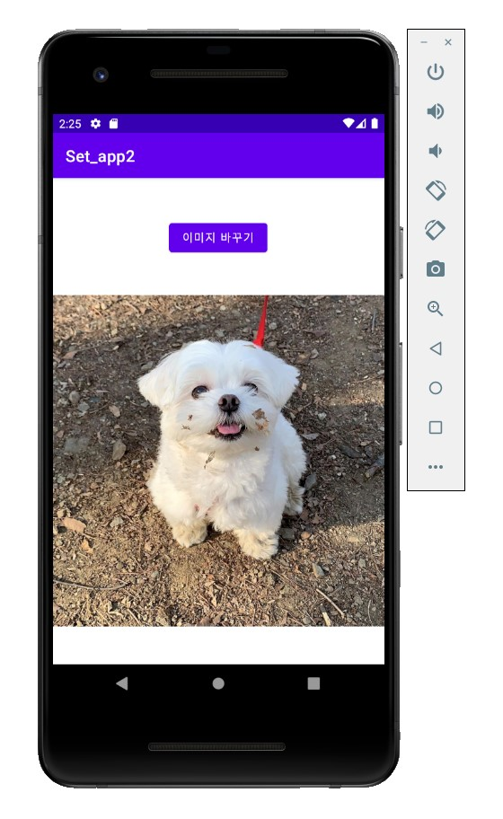</img>
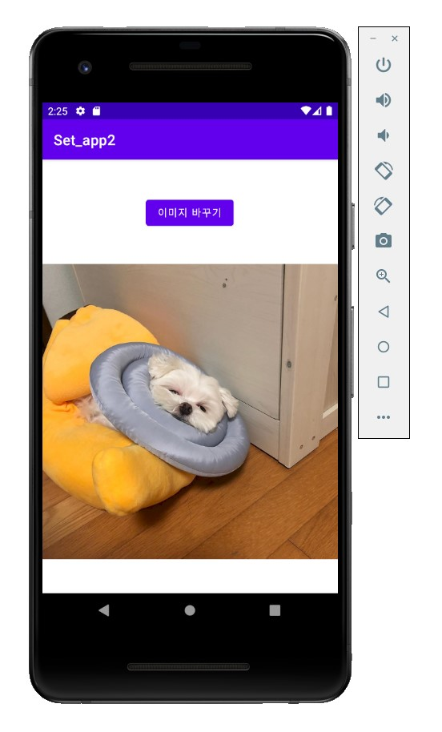</img>

## 6주차 과제

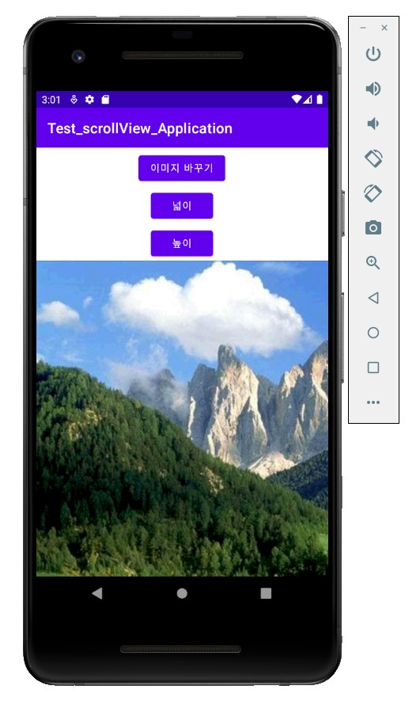</img>
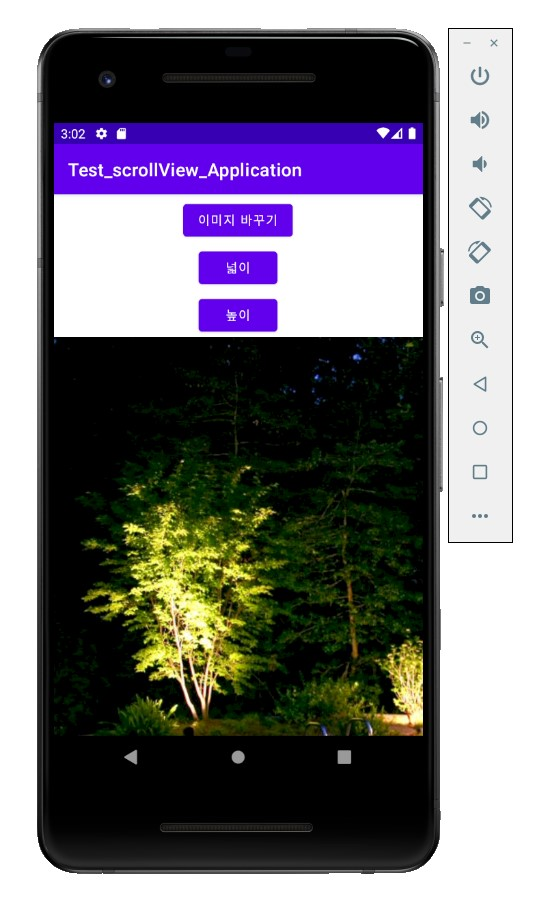</img>

## 7주차 과제

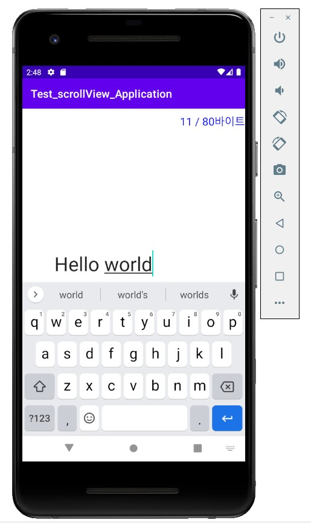</img>

## 9주차 과제

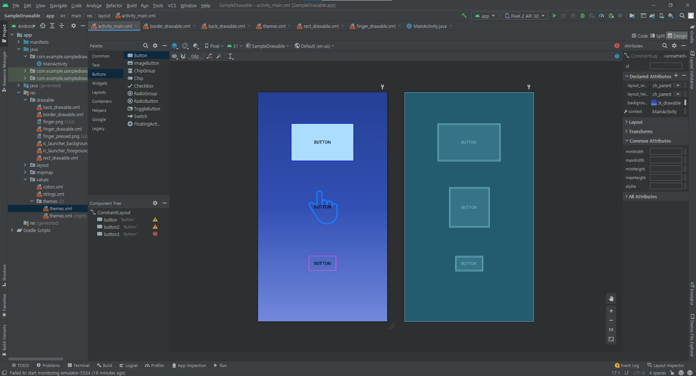</img>
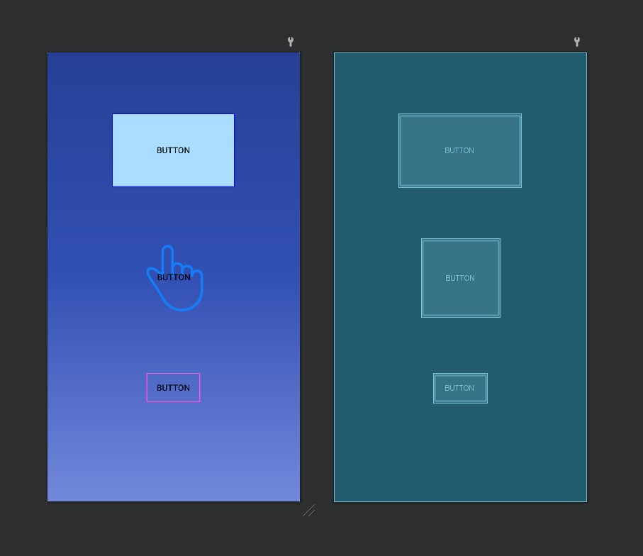</img>

## 10주차 과제

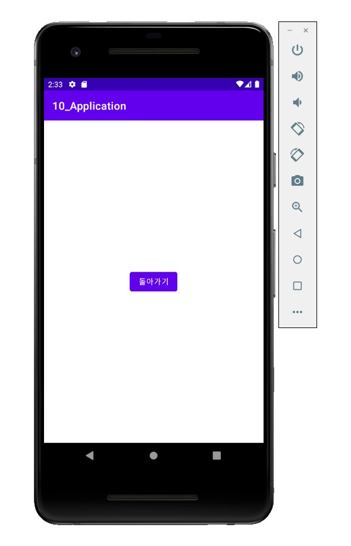</img>
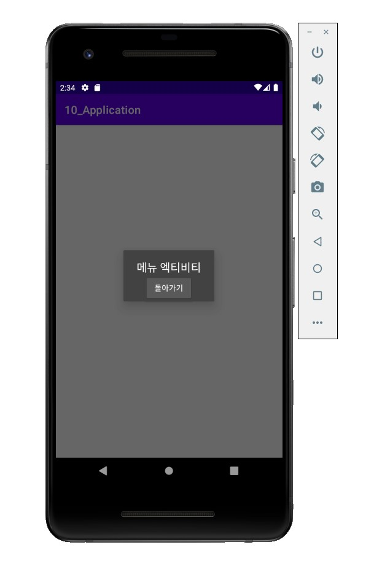</img>
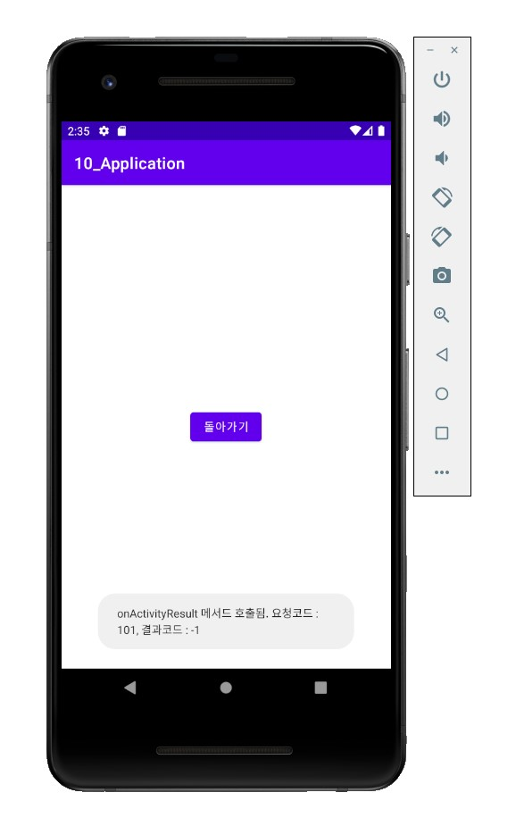</img>
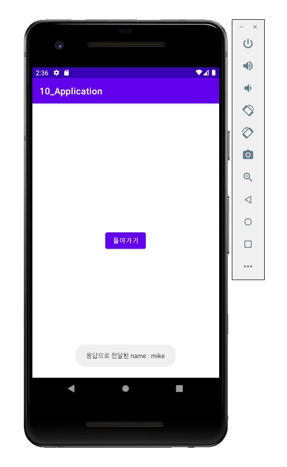</img>

## 11주차 과제

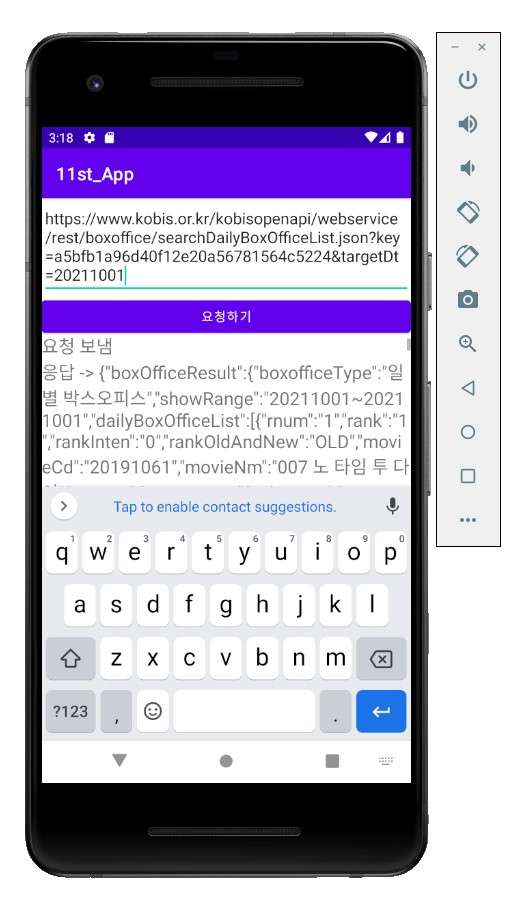</img>

## 12주차 과제

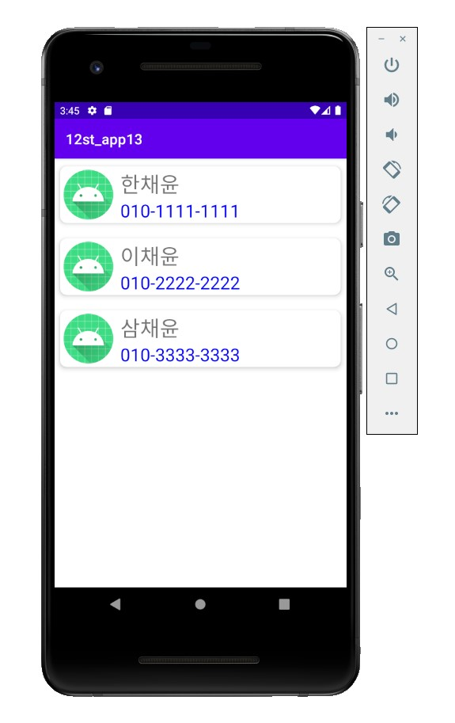</img>

## 13주차 과제

 김한결 교수님, 안녕하세요. 한채윤(20273029)입니다.

 다름이 아니라 깃허브 연동에 문제가 있어 해당 주차 과제를 업로드 하지 못했습니다. 죄송합니다. 연동 문제를 최대한 빨리 해결하여 늦더라도 꼭 업로드 하도록 하겠습니다. 다시 한 번 죄송합니다.

 감사합니다.
